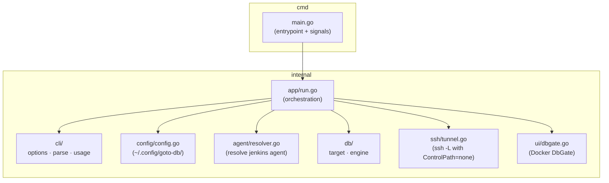

# goto-db

SSH tunnel to databases via jump host + Jenkins agent, with built-in DbGate UI.

## Install

```bash
cd cmd/goto-db && go build -o ~/bin/goto-db .
```

Requires: Go 1.26+, Docker (for DbGate UI)

## Usage

```bash
# Connect to prod audit database (postgres)
goto-db --db audit

# Connect to RC environment
goto-db --db booking --env rc

# MySQL database
goto-db --db audit --engine mysql

# Fully qualified DB URL
goto-db --db-url mydb.us-east-1.rds.amazonaws.com

# Set/update Jenkins agent (short name auto-expands)
goto-db --db audit --agent jenkins-agent80

# Refresh cached Jenkins agent
goto-db --refresh
```

## What It Does

1. Resolves the Jenkins agent (default, cache, flag, or prompt)
2. Checks local port availability
3. Starts DbGate in Docker with pre-configured connection
4. Establishes SSH tunnel via system SSH
5. Opens browser — just enter DB credentials
6. On exit (Ctrl+C): stops tunnel, removes container

## Tunnel Chain

```
localhost:<local-port> → jump (via ~/.ssh/config) → <jenkins-agent> → <db-host>:<db-port>
```

## DB Domain Convention

Short name `--db audit --env prod` resolves to:
```
prod.primary.audit.db.viatorsystems.com
```

## Default Ports

| Engine | Remote Port | Local Port |
|--------|-------------|------------|
| postgres | 5432 | 15432 |
| mysql | 3306 | 13306 |

## Architecture



## Config

Jenkins agent is cached in `~/.config/goto-db/config.json`.
